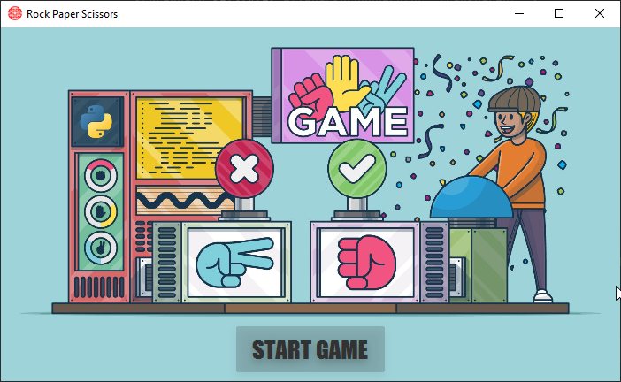
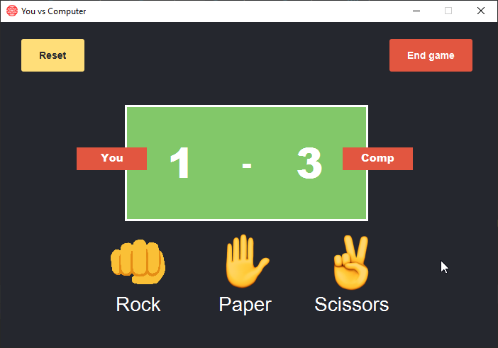
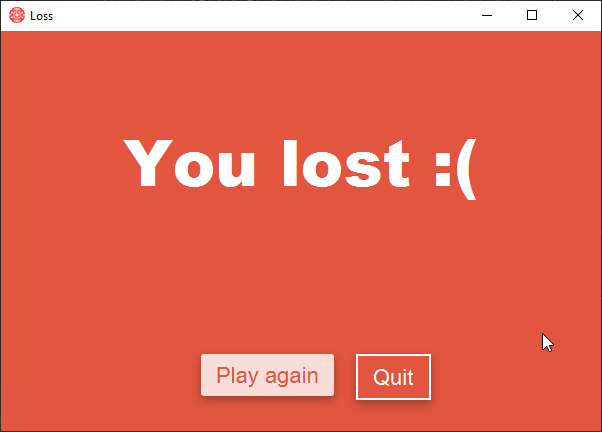
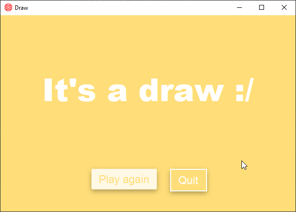
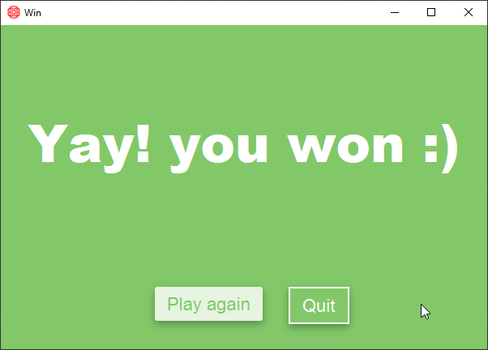

# shifumi
Rock paper scissors game project for university made using JavaFX

## Screenshot 📸

  <h3>Spalsh screen</h3>
  

  <h3>Game</h3>
  

  <h3>Lose</h3>
  

  <h3>Draw</h3>
  

  <h3>Win</h3>
  

## License 📃
These projects are open-sourced under the [MIT license](https://opensource.org/licenses/MIT)
